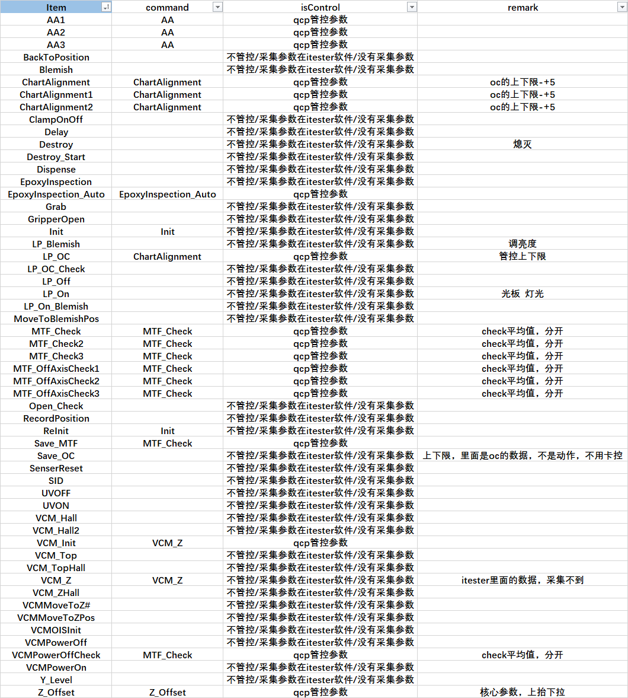

#### AA List项说明

LIST	1	Destroy_Start	Tester		Continue	Continue	Enable	
LIST	2	Init		Tester		Continue	5		Enable	
LIST	3	SID		Tester		Continue	Continue	Enable	
LIST	4	Grab		Tester		8		Continue	Enable	
LIST	5	Clmap On off	Motion		Continue	Continue	Enable	
LIST	6	re-Init		Tester		Continue	-2		Enable	
LIST	7	SensorReset	Motion		35		-2		Enable	
LIST	8	ChartAlignment1	CenterAlign	Continue	5		Enable	
LIST	9	AA1		ActiveAlign	Continue	Continue	Enable	
LIST	10	AA2		ActiveAlign	Continue	12		Enable	
LIST	11	MTF_Check	Tester		14		Continue	Enable	
LIST	12	AA3		ActiveAlign	Continue	Stop    	Enable	
LIST	13	MTF_Check2	Tester		Continue	Stop    	Enable	
LIST	14	LightPanel ON	Motion		Continue	Stop    	Enable	
LIST	15	ChartAlignnment2	CenterAlign	Continue	Stop    	Enable	
LIST	16	Blemish		Tester		19		Continue	Enable	
LIST	17	Init		Tester		Continue	Continue	Enable	
LIST	18	Blemish2	Tester		Continue	Stop    	Enable	
LIST	19	LightPanel 0	Motion		Continue	Stop    	Enable	
LIST	20	Recordposition	Motion		Continue	Stop    	Enable	
LIST	21	Dispense	Motion		Continue	Stop    	Enable	
LIST	22	EpoxyInspection Auto	Motion		24		Continue	Enable	
LIST	23	EpoxyInspection	Motion		Continue	-4		Enable	
LIST	24	BackToPosition	Motion		Continue	Continue	Enable	
LIST	25	UVON		Sync Motion	Continue	Continue	Enable	
LIST	26	Dealy		Motion		Continue	Continue	Enable	
LIST	27	Y-Level		Tester		Continue	Stop    	Enable	
LIST	28	LightPanel OFF	Motion		Continue	Continue	Enable	
LIST	29	UV OFF		Sync End	Continue	Stop    	Enable	
LIST	30	UV Check	Tester		Continue	Continue	Enable	
LIST	31	GripperOpen	Motion		Continue	Continue	Enable	
LIST	32	save oc		Tester		Continue	Stop    	Enable	
LIST	33	Open  Check	Tester		Continue	Stop    	Enable	
LIST	34	Destroy		Tester		Continue	Continue	Disable	
* 最后一列Enable、Disable表示是否记录日志的开关
* Tester 表示测试会有参数、数据
* Motion 表示动作

#### MTF_Check 管控逻辑
ITEM	13	COMMAND		GRAB3+MTF1
ITEM	13	COMPARE_MAX		
ITEM	13	COMPARE_MIN		
ITEM	13	CONNECTION_OPTION		0
ITEM	13	SEPERATE_STATION_MAX_MIN_SETTING		0
ITEM	13	RESULT		[1]	NoChk	100.00	23.00	Log	100.00	100.00	100.00	100.00	1.00	1.00	1.00	1.00	NoCompare	0.00	0.00	0.00
ITEM	13	RESULT		[2]	Check	100.00	23.00	Log	100.00	100.00	100.00	100.00	1.00	1.00	1.00	1.00	NoCompare	0.00	0.00	0.00
ITEM	13	RESULT		[3]	Check	100.00	23.00	Log	100.00	100.00	100.00	100.00	1.00	1.00	1.00	1.00	NoCompare	0.00	0.00	0.00
ITEM	13	RESULT		[4]	NoChk	100.00	23.00	Log	100.00	100.00	100.00	100.00	1.00	1.00	1.00	1.00	NoCompare	0.00	0.00	0.00
ITEM	13	RESULT		[5]	NoChk	100.00	23.00	Log	100.00	100.00	100.00	100.00	1.00	1.00	1.00	1.00	NoCompare	0.00	0.00	0.00
ITEM	13	RESULT		[6]	Check	100.00	23.00	Log	100.00	100.00	100.00	100.00	1.00	1.00	1.00	1.00	NoCompare	0.00	0.00	0.00
ITEM	13	RESULT		[7]	NoChk	100.00	23.00	Log	100.00	100.00	100.00	100.00	1.00	1.00	1.00	1.00	NoCompare	0.00	0.00	0.00
ITEM	13	RESULT		[8]	Check	100.00	23.00	Log	100.00	100.00	100.00	100.00	1.00	1.00	1.00	1.00	NoCompare	0.00	0.00	0.00
ITEM	13	RESULT		[9]	Check	100.00	56.00	Log	100.00	100.00	100.00	100.00	1.00	1.00	1.00	1.00	NoCompare	0.00	0.00	0.00
ITEM	13	RESULT		[10]	Check	100.00	56.00	Log	100.00	100.00	100.00	100.00	1.00	1.00	1.00	1.00	NoCompare	0.00	0.00	0.00
ITEM	13	RESULT		[11]	Check	100.00	56.00	Log	100.00	100.00	100.00	100.00	1.00	1.00	1.00	1.00	NoCompare	0.00	0.00	0.00
ITEM	13	RESULT		[12]	Check	100.00	56.00	Log	100.00	100.00	100.00	100.00	1.00	1.00	1.00	1.00	NoCompare	0.00	0.00	0.00
ITEM	13	RESULT		[13]	NoChk	100.00	23.00	Log	100.00	100.00	100.00	100.00	1.00	1.00	1.00	1.00	NoCompare	0.00	0.00	0.00
ITEM	13	RESULT		[14]	Check	100.00	23.00	Log	100.00	100.00	100.00	100.00	1.00	1.00	1.00	1.00	NoCompare	0.00	0.00	0.00
ITEM	13	RESULT		[15]	NoChk	100.00	23.00	Log	100.00	100.00	100.00	100.00	1.00	1.00	1.00	1.00	NoCompare	0.00	0.00	0.00
ITEM	13	RESULT		[16]	Check	100.00	23.00	Log	100.00	100.00	100.00	100.00	1.00	1.00	1.00	1.00	NoCompare	0.00	0.00	0.00
ITEM	13	RESULT		[17]	NoChk	100.00	23.00	Log	100.00	100.00	100.00	100.00	1.00	1.00	1.00	1.00	NoCompare	0.00	0.00	0.00
ITEM	13	RESULT		[18]	Check	100.00	23.00	Log	100.00	100.00	100.00	100.00	1.00	1.00	1.00	1.00	NoCompare	0.00	0.00	0.00
ITEM	13	RESULT		[19]	Check	100.00	23.00	Log	100.00	100.00	100.00	100.00	1.00	1.00	1.00	1.00	NoCompare	0.00	0.00	0.00
ITEM	13	RESULT		[20]	NoChk	100.00	23.00	Log	100.00	100.00	100.00	100.00	1.00	1.00	1.00	1.00	NoCompare	0.00	0.00	0.00
ITEM	13	RESULT		[21]	Check	100.00	38.00	Log	100.00	100.00	100.00	100.00	1.00	1.00	1.00	1.00	NoCompare	0.00	0.00	0.00
ITEM	13	RESULT		[22]	Check	100.00	38.00	Log	100.00	100.00	100.00	100.00	1.00	1.00	1.00	1.00	NoCompare	0.00	0.00	0.00
ITEM	13	RESULT		[23]	Check	100.00	38.00	Log	100.00	100.00	100.00	100.00	1.00	1.00	1.00	1.00	NoCompare	0.00	0.00	0.00
ITEM	13	RESULT		[24]	Check	100.00	38.00	Log	100.00	100.00	100.00	100.00	1.00	1.00	1.00	1.00	NoCompare	0.00	0.00	0.00
ITEM	13	RESULT		[25]	Check	100.00	38.00	Log	100.00	100.00	100.00	100.00	1.00	1.00	1.00	1.00	NoCompare	0.00	0.00	0.00
ITEM	13	RESULT		[26]	Check	100.00	38.00	Log	100.00	100.00	100.00	100.00	1.00	1.00	1.00	1.00	NoCompare	0.00	0.00	0.00
ITEM	13	RESULT		[27]	Check	100.00	38.00	Log	100.00	100.00	100.00	100.00	1.00	1.00	1.00	1.00	NoCompare	0.00	0.00	0.00
ITEM	13	RESULT		[28]	Check	100.00	38.00	Log	100.00	100.00	100.00	100.00	1.00	1.00	1.00	1.00	NoCompare	0.00	0.00	0.00
ITEM	13	RESULT		[29]	Check	100.00	38.00	Log	100.00	100.00	100.00	100.00	1.00	1.00	1.00	1.00	NoCompare	0.00	0.00	0.00
ITEM	13	RESULT		[30]	Check	100.00	38.00	Log	100.00	100.00	100.00	100.00	1.00	1.00	1.00	1.00	NoCompare	0.00	0.00	0.00
ITEM	13	RESULT		[31]	Check	100.00	38.00	Log	100.00	100.00	100.00	100.00	1.00	1.00	1.00	1.00	NoCompare	0.00	0.00	0.00
ITEM	13	RESULT		[32]	Check	100.00	38.00	Log	100.00	100.00	100.00	100.00	1.00	1.00	1.00	1.00	NoCompare	0.00	0.00	0.00
ITEM	13	RESULT		[33]	Check	100.00	38.00	Log	100.00	100.00	100.00	100.00	1.00	1.00	1.00	1.00	NoCompare	0.00	0.00	0.00
ITEM	13	RESULT		[34]	Check	100.00	38.00	Log	100.00	100.00	100.00	100.00	1.00	1.00	1.00	1.00	NoCompare	0.00	0.00	0.00
ITEM	13	RESULT		[35]	Check	100.00	38.00	Log	100.00	100.00	100.00	100.00	1.00	1.00	1.00	1.00	NoCompare	0.00	0.00	0.00
ITEM	13	RESULT		[36]	Check	100.00	38.00	Log	100.00	100.00	100.00	100.00	1.00	1.00	1.00	1.00	NoCompare	0.00	0.00	0.00
ITEM	13	RESULT		[37]	Check	100.00	25.00	Log	100.00	100.00	100.00	100.00	1.00	1.00	1.00	1.00	NoCompare	0.00	0.00	0.00
ITEM	13	RESULT		[38]	Check	100.00	25.00	Log	100.00	100.00	100.00	100.00	1.00	1.00	1.00	1.00	NoCompare	0.00	0.00	0.00
ITEM	13	RESULT		[39]	Check	100.00	25.00	Log	100.00	100.00	100.00	100.00	1.00	1.00	1.00	1.00	NoCompare	0.00	0.00	0.00
ITEM	13	RESULT		[40]	Check	100.00	25.00	Log	100.00	100.00	100.00	100.00	1.00	1.00	1.00	1.00	NoCompare	0.00	0.00	0.00
ITEM	13	RESULT		[41]	Check	100.00	25.00	Log	100.00	100.00	100.00	100.00	1.00	1.00	1.00	1.00	NoCompare	0.00	0.00	0.00
ITEM	13	RESULT		[42]	Check	100.00	25.00	Log	100.00	100.00	100.00	100.00	1.00	1.00	1.00	1.00	NoCompare	0.00	0.00	0.00
ITEM	13	RESULT		[43]	Check	100.00	25.00	Log	100.00	100.00	100.00	100.00	1.00	1.00	1.00	1.00	NoCompare	0.00	0.00	0.00
ITEM	13	RESULT		[44]	Check	100.00	25.00	Log	100.00	100.00	100.00	100.00	1.00	1.00	1.00	1.00	NoCompare	0.00	0.00	0.00
ITEM	13	RESULT		[45]	Check	100.00	25.00	Log	100.00	100.00	100.00	100.00	1.00	1.00	1.00	1.00	NoCompare	0.00	0.00	0.00
ITEM	13	RESULT		[46]	Check	100.00	25.00	Log	100.00	100.00	100.00	100.00	1.00	1.00	1.00	1.00	NoCompare	0.00	0.00	0.00
ITEM	13	RESULT		[47]	Check	100.00	25.00	Log	100.00	100.00	100.00	100.00	1.00	1.00	1.00	1.00	NoCompare	0.00	0.00	0.00
ITEM	13	RESULT		[48]	Check	100.00	25.00	Log	100.00	100.00	100.00	100.00	1.00	1.00	1.00	1.00	NoCompare	0.00	0.00	0.00
ITEM	13	RESULT		[49]	Check	100.00	25.00	Log	100.00	100.00	100.00	100.00	1.00	1.00	1.00	1.00	NoCompare	0.00	0.00	0.00
ITEM	13	RESULT		[50]	Check	100.00	25.00	Log	100.00	100.00	100.00	100.00	1.00	1.00	1.00	1.00	NoCompare	0.00	0.00	0.00
ITEM	13	RESULT		[51]	Check	100.00	25.00	Log	100.00	100.00	100.00	100.00	1.00	1.00	1.00	1.00	NoCompare	0.00	0.00	0.00
ITEM	13	RESULT		[52]	Check	100.00	25.00	Log	100.00	100.00	100.00	100.00	1.00	1.00	1.00	1.00	NoCompare	0.00	0.00	0.00
##### 视场点位说明及管控范围
* cc
  9~12
* 0.8F 
  1~8 & 13~20
* 0.3F
  21~35
* 0.6F
  36~52

**ASM算法**
* cc 56
* .3F 38
* .6F 25
* .8F 23